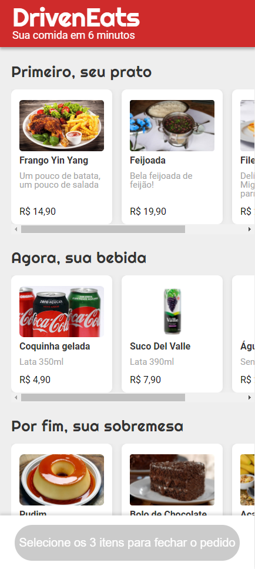

[![Contributors][contributors-shield]][contributors-url]
[![Forks][forks-shield]][forks-url]
[![Stargazers][stars-shield]][stars-url]
[![Issues][issues-shield]][issues-url]
[![MIT License][license-shield]][license-url]
[![LinkedIn][linkedin-shield]][linkedin-url]

# Projeto - DrivenEats

### Projeto usando JavaScript de implementação do site mobile do DrivenEats, um restaurante especial que entrega seu pedido em 6 minutos.
### O site permite de forma fácil a escolha do seu combo, enviando em seguida o pedido por WhatsApp diretamente para o restaurante.
 
### Realizado por Gabriel Neves no Bootcamp Responde Aí

### Site disponivel em: https://neves-gabriel.github.io/Projeto-03---DrivenEats/

#### Preview do projeto:

<!-- MARKDOWN LINKS & IMAGES -->
<!-- https://www.markdownguide.org/basic-syntax/#reference-style-links -->
[contributors-shield]: https://img.shields.io/github/contributors/neves-gabriel/DrivenEats.svg?style=for-the-badge
[contributors-url]: https://github.com/neves-gabriel/DrivenEats/graphs/contributors
[forks-shield]: https://img.shields.io/github/forks/neves-gabriel/DrivenEats.svg?style=for-the-badge
[forks-url]: https://github.com/neves-gabriel/DrivenEats/network/members
[stars-shield]: https://img.shields.io/github/stars/neves-gabriel/DrivenEats.svg?style=for-the-badge
[stars-url]: https://github.com/neves-gabriel/DrivenEats/stargazers
[issues-shield]: https://img.shields.io/github/issues/neves-gabriel/DrivenEats.svg?style=for-the-badge
[issues-url]: https://github.com/neves-gabriel/DrivenEats/issues
[license-shield]: https://img.shields.io/github/license/neves-gabriel/DrivenEats.svg?style=for-the-badge
[license-url]: https://github.com/neves-gabriel/DrivenEats/blob/master/LICENSE.txt
[linkedin-shield]: https://img.shields.io/badge/-LinkedIn-black.svg?style=for-the-badge&logo=linkedin&colorB=555
[linkedin-url]: https://www.linkedin.com/in/gabriel-rodrigues-neves/
[product-screenshot]: images/screenshot.png
